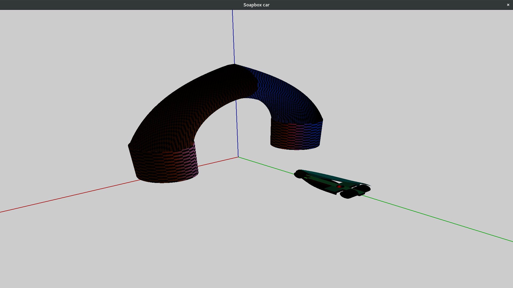

# opengl-car
A futuristic soapbox car in OpenGL for the course Computergraphics by Herman Crauwels (Campus De Nayer, KU Leuven). This application provides a demo for several OpenGL functions and is written in ANSI C.

## Features
- [x] Basic car
- [x] Basic finish
- [x] Multiple 3D transformations (orthogonal, symmetric, ...)
- [x] Multiple cars on the screen
- [x] Show axes, light sources, ... controlled with a keyboard key
- [x] Improved finish
- [x] 4 different light sources
- [x] Switch between several shade models
- [x] Menu to configure the materials used to create the car
- [x] Keyboard shortcuts
- [x] Animates the wheels of the car
- [x] Texture support of the finish and the car
- [x] Toggle the alpha value of the car
- [x] Fog support

## Screenshots

### Competition mode with menu

### Blending, different types of illumination and other features

## Shortcuts

### Mouse
- Right click to show the menu where you can select several materials for each component of the car.

- You can also quit the application from the menu if you like.

### Keyboard

| Key | Description                              |
|:---:| ---------------------------------------- |
| x/X | Move camera (X axis +/-)                 |
| y/Y | Move camera (Y axis +/-)                 |
| z/Z | Move camera (Z axis +/-)                 |
| i   | Move camera to it's initial position     |
| 1   | Toggle ambient light (GL_LIGHT0)         |
| 2   | Toggle diffuse light (GL_LIGHT1)         |
| 3   | Toggle specular light (GL_LIGHT2)        |
| 4   | Toggle spot light (GL_LIGHT3)            |
| s   | Switch to shading mode _SMOOTH_          |
| S   | Switch to shading mode _FLAT_            |
| l   | Turn wireframe mode _ON_                 |
| L   | Turn wireframe mode _OFF_                |
| j   | Turn axes _ON_                           |
| J   | Turn axes _OFF_                          |
| p   | Turn light positions _ON_                |
| P   | Turn light positions _OFF_               |
| k   | Turn checkpoints _ON_                    |
| K   | Turn checkpoints _OFF_                   |
| g   | Toggle wheel animation                   |
| G   | Toggle car animation                     |
| t   | Toggle textures                          |
| m   | Toggle fog                               |
| M   | Toggle fog mode (_LINEAR / EXP_)         |
| n   | Toggle competition mode                  |
| f   | Toggles coachwork transparency           |
| h/H | Moves the spot height (+/-)              |
| v/V | Manipulates the spot angle (+/-)         |
| w/W | Manipulates the spot exponent (+/-)      |
| b   | Toggles light locking                    |
| e/E | Manipulates the material shininess (+/-) |
| q/Q | Quits the application                    |

## How to build

1. Clone this repo: `git clone https://github.com/DylanVanAssche/opengl-car.git`
2. Enter the directory: `cd opengl-car`
3. Install all OpenGL libraries via your package manager, you can find the dependencies in the MakeFile.
4. Run `make` in the project directory.
5. Run `./car` to start the soapbox car.

## License
- Everything (except for the images, `initJPG.c` and `initJPG.h`) in this repository is available under the GPLv3 license.

- The images are available under separate licenses, see the folder `images` for more information.
- For `initJPG.c` and `initJPG.h` files, please check the comments in the files for more information.
